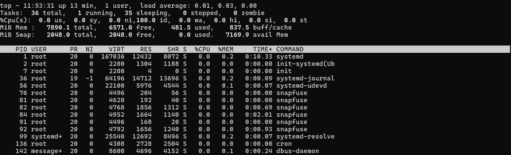
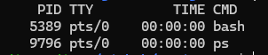
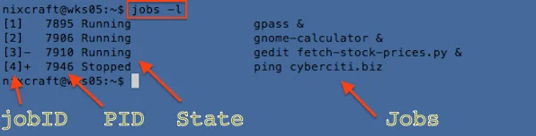

# Tops, Ps, Jobs, Kill 에 관하여
각각 Tops, Ps, Jobs, Kill 은 윈도우 문법과 비교하여 설명할 수 있습니다.
| 리눅스      | 윈도우        |
|-------------|---------------|
| `top`       | Task Manager  |
| `ps`        | `tasklist`    |
| `jobs`      | `Get-Job`     |
| `kill`      | `taskkill`    |

- ## Top
  `top`명령어는 시스템의 현재 상태를 실시간으로 보여줍니다. CPU 및 메모리 사용률, 각 프로세스의 상태 등을 모니터링할 수 있습니다.
  

- ## Ps
  `ps` 명령어는 현재 실행 중인 프로세스를 스냅샷 형태로 보여줍니다.  
  `ps aux`와 같은 옵션을 사용하면 모든 프로세스의 자세한 정보를 볼 수 있습니다.  
  

- ## Jobs
  `jobs` 명령어는 현재 쉘 세션에서 백그라운드로 실행 중인 작업 목록을 보여줍니다.  
  이 명령어는 주로 &를 사용해 백그라운드에서 실행된 작업을 관리할 때 사용됩니다.
  

- ## kill
  `kill` 명령어는 특정 프로세스를 종료하는 데 사용됩니다.  
  예를 들어 kill -9 <PID>는 강제로 프로세스를 종료합니다.
  
